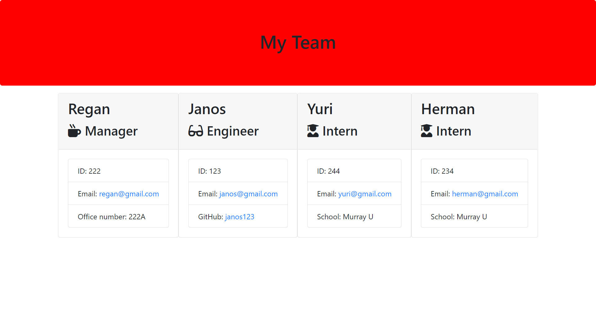
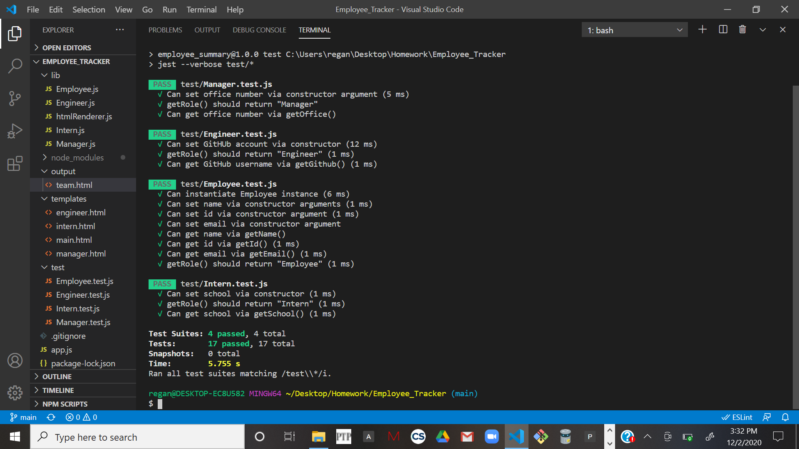

# Employee_Summary
## Unit 10 OOP Homework: Template Engine
One of the most important aspects of programming is writing code that is readable, reliable, and maintainable. Oftentimes, how we design our code is just as important as the code itself. 

This application uses a node CLI to takes in information about employees and generates an HTML webpage that displays summaries for each individual. The application prompts the user for information about the team manager and then information about the team members. The user can input any number of team members, and they may be a mix of engineers and interns. When the user has completed building the team, the application will create an HTML file that displays a nicely formatted team roster based on the information provided by the user. 

## User Story
As a manager
I want to generate a webpage that displays my team's basic info
so that I have quick access to emails and GitHub profiles

## Usage
To use this application, run "node app.js" in your terminal to prompt the questions to begin. You will then have the option to enter as many employees as you wish or to exit the application. The questions will prompt the user to enter the revelent information based on the chosen employee designation.  When the user is finished, they can exit the CLI and the application will use the entered information to render an HTML file displaying the employee roster.

## Images

